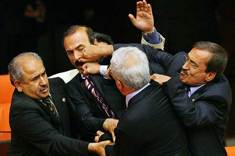

# Fantasy Nuclear Football #

## Team Members ##
* Sen RaoRao
* Nick 'the quick' Scricco
* David 'Manning' Reiman
* The artist formally known as Bruno
* Tyler 'Pyscho T' Waneka

## Project: Fantasy Politics ##
Objective: Create a fanasty site where users can manage a 'team' of politicians in competition against other 'teams' in a league. Points are awarded based on various measurable statistics that are created from the glorious American political system.

## MVP ##

* Register
* Create League
* Create Team
* Enter off-line draft
* Define scoring "plays"/value
* Calculate score
	* Sorting ranks based on points
	* Sorting ranks for each point category
* Team standings

### Extended Features ###

* Adding/Dropping players
* Bench vs Active
* Trades
* Injured Reserve (affairs?)
* President Points

Super Extended Features

* Live Draft

## SCORING ##

At the capital: (Sunlight Legislators API)

* sponsoring a bill
* attendance
* voted on a bill that passes
* speaking on the floor

In the media: (Twitter and/or media API)

* twitter mentions
* +/- followers

#### Resources ####
* Rubydocs [Cabybara documentation](http://rubydoc.info/gems/capybara/2.1.0/frames)
* [Integration](http://www.sinatrarb.com/testing.html) with Sinatra
* More [integration](http://www.noppanit.com/cucumber-capybara-sinatra/)
* [Matchers](http://rubydoc.info/gems/capybara/2.1.0/Capybara/Node/Matchers)
* [Actions](http://rubydoc.info/gems/capybara/2.1.0/Capybara/Node/Actions)
* [Finders](http://rubydoc.info/gems/capybara/2.1.0/Capybara/Node/Finders)
* Capybara [cheat sheet](https://gist.github.com/zhengjia/428105)

##### Smurfs #####
###### Monday ######
* user can login with facebook
* user can create team
* user can see his/her team
* user can see other users' teams